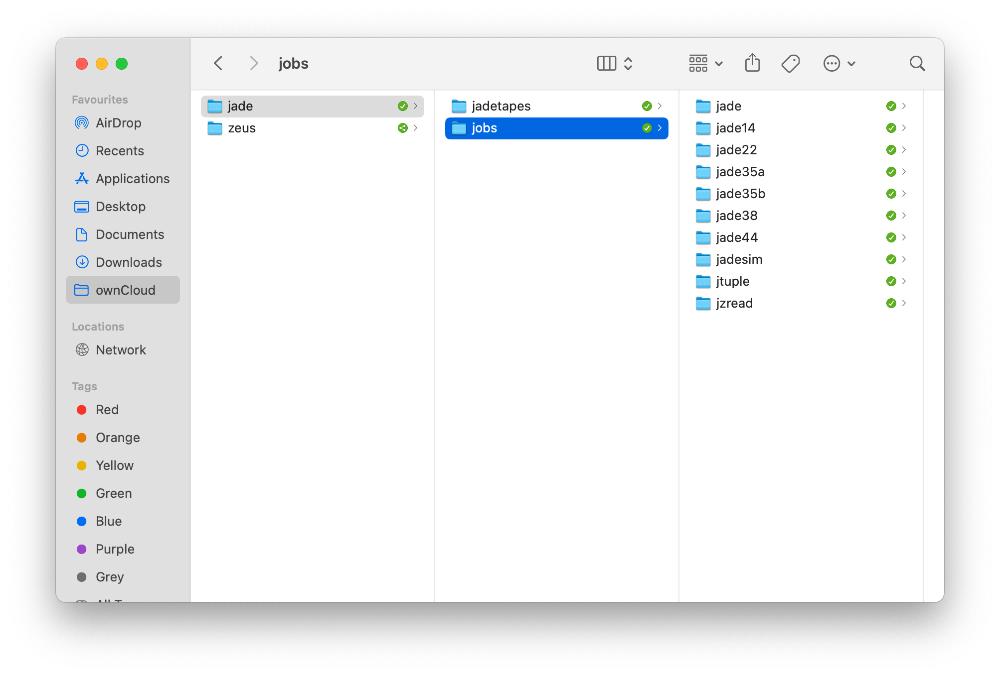
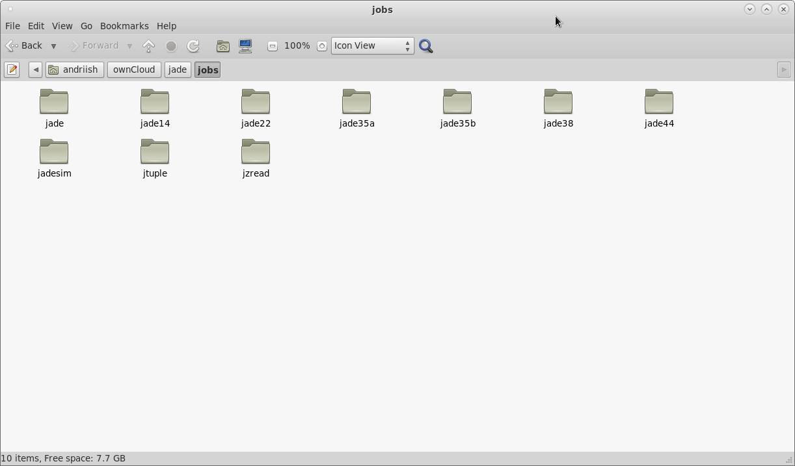
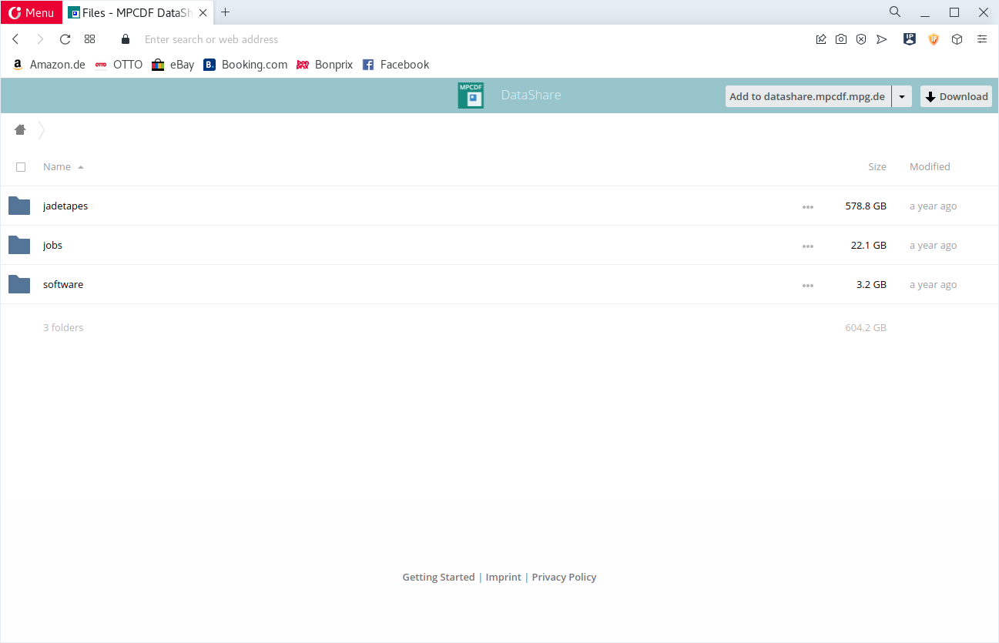

# Data Access 

To access the JADE data in MPCDF one of the following ways can be used:

## With MPCDF account 
  - Login to https://selfservice.mpcdf.mpg.de
  - Go to ``My Services`` and enable ``DataShare``
  - Install ownCloud client https://owncloud.com/desktop-app/ and configure it with your MPCDF account
  - Request a__n__drii.__verbytskyi@__mpp.__mpg__.de to share the ownCloud resource link (underscores to be removed)

The JADE data in ownCloud will be available in the Finder 

or in the Linux file manager, e.g.

## With a public link

  - Request a__n__drii.__verbytskyi@__mpp.__mpg__.de to share the ownCloud public link and a password (underscores to be removed)

The link can be used to access the data via web-browser

